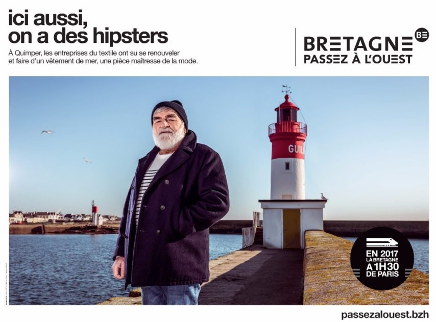

# Exemple de Marketing Territorial
---------------------------------------

## "Passez à l'Ouest", une campagne à succès

En 2017, la région Bretagne, à l'aide de l'agence DDB Notchup, lance une campagne de marketing territorial décalée qui fait un carton. Dans le but de promouvoir la nouvelle ligne de TGV qui relie en 1h30 Rennes de Paris, la campagne avait pour but de reprendre les inconvénients de la vie parisienne et leur trouvé des équivalents en Bretagne. Placardée dans toute la France pendant des semaines, ainsi que sur tous les réseaux sociaux tels que *Twitter*, et *Facebook*, la campagne publicitaire prend de l'ampleur et le conseil de Bretagne décide de laisser les entreprises, et villes de la région participer à la campagne et beaucoup se sont prêté au jeu : le Stade Brestois 29, la ville de Lorient ou encore Rennes Métropole. 

Le succès de la campagne a encouragé la région a renouveler la campagne en 2019 dans le but de trouver de nouvelles entreprises

------------------------------------------------------------------------------------------------
[page d'accueil](index.md)
