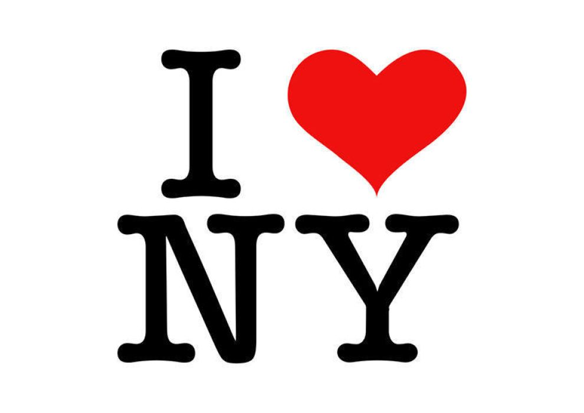
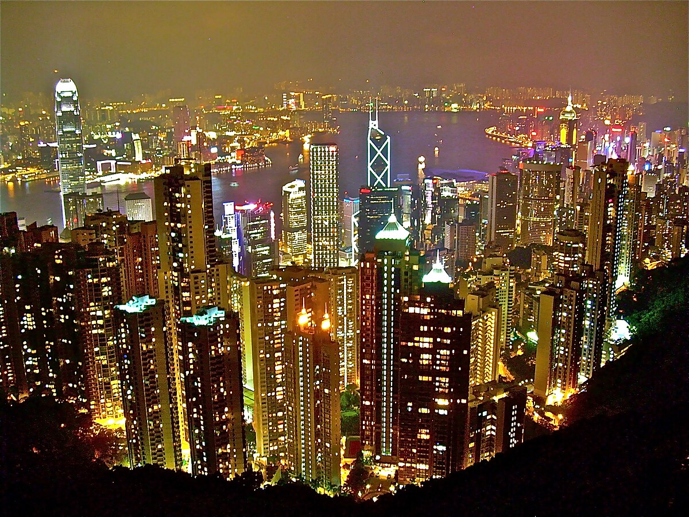

# Exemples de Marketing Territorial
---------------------------------------

## "Passez à l'Ouest" - une campagne à succès

En 2017, la région Bretagne, à l'aide de l'agence DDB Notchup, lance une campagne de marketing territorial décalée qui fait un carton. Dans le but de promouvoir la nouvelle ligne de TGV qui relie en 1h30 Rennes de Paris, la campagne avait pour but de reprendre les inconvénients de la vie parisienne et leur trouvé des équivalents en Bretagne. Placardée dans toute la France pendant des semaines, ainsi que sur tous les réseaux sociaux tels que *Twitter*, et *Facebook*, la campagne publicitaire prend de l'ampleur et le conseil de Bretagne décide de laisser les entreprises, et villes de la région participer à la campagne et beaucoup se sont prêté au jeu : le Stade Brestois 29, la ville de Lorient ou encore Rennes Métropole. 

Le succès de la campagne a encouragé la région a renouveler la campagne en 2019 dans le but de rendre le territoire plus attractifs pour les chercheurs d'emplois et chef d'entreprise !

## "I ♥️ New-York" - La création d'une marque reconnaissable

I ♥️ New-York, I ♥️ Paris ou bien encore I ♥️ Milan, ce branding iconique est le logo touristique le plus facilement reconnaissable par de bon nombre de personnes. Il est particulièrement associé à la ville de New-York où il est détourné sous toutes ces formes: T-shirts, sacs, mugs et bien plus encore. C'est avec l'établissement de ce genre de logo qu'un territoire se fait connaître et attire d'autant plus de touristes. 

## Hong Kong - capitale de la technologie

Les villes peuvent également jouer de leur réputation afin de faire une campagne de communication réussie. C'est ainsi que la ville d'Hong Kong, réputée pour la haute-technologie, à décidé d'en faire un atout en terme de tourisme également. C'est pourquoi Discover Hong Kong en partenariat avec la tour d'observation sky100 et la société de réalité virtuelle TimeLooper ont lancé une attraction qui attisera les foules: un casque en réalité virtuelle permettant au spectateur d'être transporté dans le Hong Kong des années soixante et quatre-vingt. Grâce au bouche-à-oreille, l'attraction est vite devenue une visite incontournable à faire de la métropole. 

------------------------------------------------------------------------------------------------
[<< Revenir au menu](index.md)
