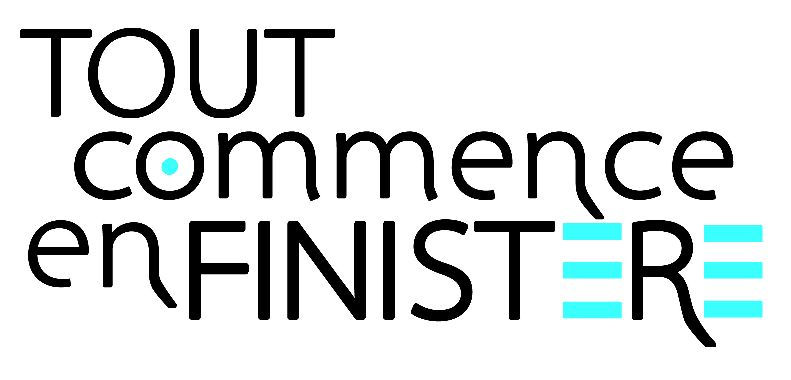

# Le Marketing Territorial 
---------------------------------------------------------------------

_Le tourisme est une des industries ayant été la plus touchée par la crise sanitaire qui a frappé le monde entier en 2020. Malgré cela, et la fermeture de nombreuses infrastructures,
l’industrie se relève progressivement. En effet selon l’Organisation Mondiale du Tourisme, le tourisme mondial aurait atteint 84% des niveaux pré-pandémiques lors du premier semestre de
l’année 2023. Cette relance progressive s’est accompagnée de nouvelles stratégies marketing, ciblant un public plus national et local qu’international. Cette organisation de campagne marketing
afin d’attirer une clientèle nationale, en cherchant à augmenter l’attractivité de son territoire auprès des touristes se désigne sous la branche de marketing territorial._ 

## Le marketing territorial qu’est-ce que c’est ?
Avant même de pouvoir parler des différents manières à travers lesquelles il se manifeste, il est important de définir avec plus de précisions ce qu'est le marketing territorial.
Ainsi, en 2013 le Mercator pour le marketing d'entreprise le décrit comme-ceci:
> Le marketing territorial, c'est l'effort collectif de valorisation et d’adaptation des territoires à des marchés concurrentiels, pour influencer, en leur
faveur, le comportement de leurs publics par une offre différente dont la valeur perçue est durablement supérieure à celle des concurrents.

Bien qu'elle emprunte son nom au marketing la discipline s'inspire également d'autres disciplines entre-autres :
* La communication
* L'aménagement des territoires
* Le développement local
* L'économie des biens-publics
  
Le marketing territorial est également connu sous les noms de marketing de lieu ou de destination. 

## Les acteurs
De nombreux acteurs sont concernés par ce type de marketing, à plusieurs échelles car la revalorisation d’un territoire peut se faire autant au niveau régional, qu’à celui d’une ville ou d’un territoire. Que ce soient des acteurs publics, tels que les municipalités ou les offices de tourisme, que les acteurs privés, le marketing territorial est bénéfique à tous les niveaux car ils augmentent les opportunités.
1. Les **collectivités locales**, comme les municipalités, les conseils régionaux ou communauté de communes sont les principaux acteurs du marketing territoirial. Ils développent des techniques propres à leurs territoires, afin d'assurer leurs développement économique, social et culturel.
2. Les **offices de tourisme** jouent un rôle crucial dans la promotion touristique d'un territoire. Ils attirent les visiteurs, cherchent à améliorer l'expérience des visiteurs et ainsi développe l'industrie touristique d'un territoire donné.
3. Les **entreprises privées locales**, tel que les restaurants, boutique de souvenir et autres acteurs touristiques, sont concernés par le marketing territorial. Elles peuvent sponsoriser des évènements, équipes sportives locales, et participer à des projets de développement local.
4. Les **établissements d'enseignement et de recherche** peuvent également contribuer au marketing de destination, en concevant des programmes d'enseignements ou de recherches ciblés et en contribuant à l'attractivité du territoire. Ainsi, le pôle quimperois de l'Université de Bretagne Occidentale comprend dans son catalogue une formation au management des activités et structures littorales, préparant ainsi les étudiants à devenir des futurs cadres officiant sur la côte bretonne.
5. Enfin, un autre agent majeur du marketing territorial à retenir sont les **agences de communication et marketing**, engagées par certains territoires, ces agences peuvent concevoir des campagnes marketing pour aider à la promotion d'un territoire. 

## Les différentes techniques marketing
Le marketing de destination à des techniques particulières pour promouvoir les territoires, en voici quelques-unes fréquemment utilisées : 

1. **Branding territorial**
Créer une identité forte, et distinctive est une façon idéale de démarquer un territoire des autres et d'attirer ainsi de nouveaux touristes, et investisseurs.
La création d'un logo comme celui-ci est une des premières étapes d'un branding territorial:

3. **Promotion touristique**
Il est important de promouvoir les attractions touristiques d'un territoire pour y attirer les touristes. Pour cela, les parternariats avec des entreprises du tourismes, des évènements et campagnes promotionnelles sont des excellents moyens de faire de la promotion touristique. La petite ville d'Isle et Villaine de Bécherelle est ainsi partenaire avec l'office du tourisme de Rennes, chef-lieu de Bretagne, qui redirige les visiteurs cible de la ville de Bescherelle.

4. **Evènements et festivals**
Organiser des évènements et festivals de musiques, d'art dramatique ou tout autre intérêt culturel est le meilleur moyen d'attirer des visiteurs qui n'aurait autrement jamais songé visiter le territoire. Ainsi, la petite ville de 1 000 habitants de Sibiril, dans le Finistère nord, organise depuis maintenant deux ans le Pist'ribil, festival de musique électronique cherchant à attirer un public jeune qui se détourne autrement des villages ruraux.

5. **Marketing digital**
Le marketing digital est évidemment une part crucial de la promotion d'un territoire. Les campagnes de communication en ligne sont le meilleur moyen de promouvoir un territoire à grande échelle. Ainsi, de nombreuses régions contacte des influenceurs, stars des réseaux sociaux, afin de promouvoir indirectement à leur public les territoires et les rendre attractifs. La qualité instagrammable d'un territoire est devenu un critère majeur de choix de destination de voyage pour les plus jeunes, c'est ainsi que la communauté de lac de Wanaka en Nouvelle-Zélande collabore avec des influenceurs afin de rendre attractif le lac.

6. **Investissement dans l'économie locale**
Enfin, soutenir le développement économique local est une manière de redynamiser le territoire et le rendre plus attractif, notammant en promouvant l'entrepreneuriat, ou en attirant de nouveaux habitants. Ainsi, bon nombre de villages cède des terrains au prix d'1€ le m² afin d'attirer de jeunes ménages n'ayant pas autrement les moyens de s'installer. Le territoire de Grand-Orly Seine Bièvre en région Ile-de-France quant à lui cherche à attirer les entreprises sur son territoire notamment aux salons [Techinnov](https://www.techinnov.events/), ou bien le [Salon de l'immobilier d'entreprise](https://www.salonsimi.com/)
   
Pour en apprendre plus sur les techniques de traduction cliquez [ici](interculturality.md)

Pour plus de clarté, cliquez [ici](case20%study.md) pour voir des illustrations. 

[Me contacter](...)
